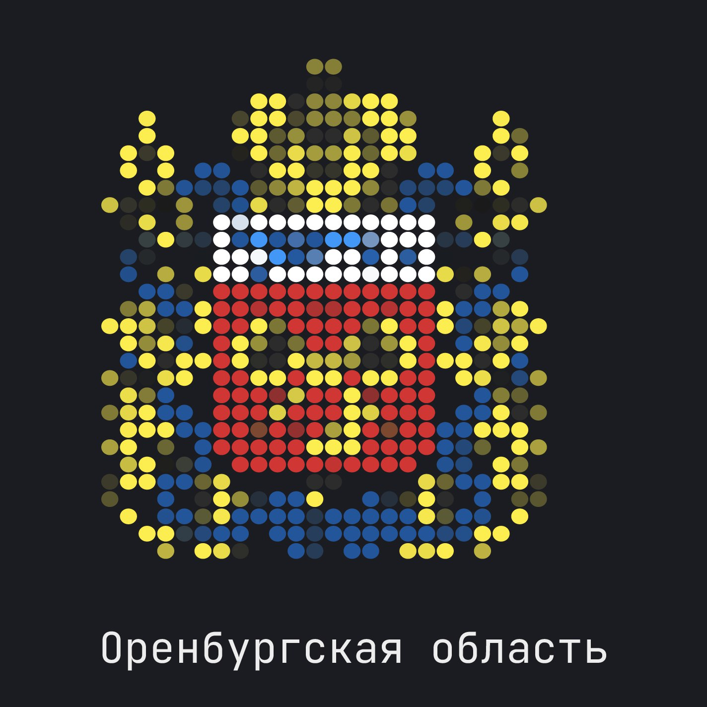

# 📖 **Книга Памяти Оренбургской области**

## 📌 **Описание проекта**

Книга Памяти Оренбургской области — это интерактивная электронная система, увековечивающая память о жителях региона, погибших при защите Отечества. Проект объединяет данные о героях в удобном цифровом формате с возможностью поиска, фильтрации, просмотра информации и документальных свидетельств.

---

## **О мероприятии**




Данный проект был разработан в рамках **Областных соревнований по спортивному программированию «OrenIT»**

- **Дисциплина**: Программирование продуктовое  
- **Команда**: davg  
- **Даты проведения**: 14-17 февраля 2025

---

## **Описание проекта**

### ❗ Проблема

Историческая память нуждается в сохранении и структурировании. В настоящее время сведения о погибших защитниках разбросаны по архивам, военкоматам и частным коллекциям родственников, что делает их труднодоступными.

Существующие цифровые базы данных либо ограничены по функционалу, либо не позволяют полноценно работать с историческими документами, картографическими данными и художественным оформлением.

### 🎯 Цель проекта

Создание интерактивного цифрового ресурса, который:

✅ Систематизирует данные о погибших жителях Оренбургской области.

✅ Позволяет быстро находить и фильтровать информацию.

✅ Обеспечивает художественное оформление данных в виде печатных страниц.

✅ Поддерживает удобный ввод, редактирование и верификацию данных.

✅ Интегрируется с геоинформационной системой NextGIS для визуализации данных на карте.

✅ Предоставляет разные уровни доступа: обычным пользователям, представителям организаций и администраторам.

### ⚙ Основной функционал

📍 Интерактивная карта

🔍 Фильтрация и поиск по ФИО, муниципальному образованию и вооружённому конфликту

📄 Просмотр сведений о погибшем (ФИО, биография, воинское звание, награды, архивные документы)

🖼 Генерация художественного оформления страницы с биографией и наградами

🖊 Система внесения данных с верификацией

🔑 Авторизация через логин/пароль и OAuth2 (ЕЛК)

📝 Личный кабинет администратора (управление записями, модерация, ведение логов)

🗂 Логирование всех изменений

## 🏗 **Архитектура решения**

Проект построен на микросервисной архитектуре и разделён на несколько независимых сервисов, взаимодействующих через API.

🔹 Фронтенд: React + Gravity UI

- Визуализация интерактивной карты и страниц книги
- Отображение информации по погибшим
- Личный кабинет администратора

🔹 Бэкенд: Python (FastAPI) + Go (микросервисы)

- FastAPI — сервис авторизации и управления пользователями
- Go — микросервисы для работы с записями, черновиками, логами

🔹 База данных: PostgreSQL + MongoDB

- PostgreSQL — основное хранилище данных (структурированная информация о погибших)
- MongoDB — хранение динамических данных и метаинформации

🔹 Интеграции:

- ✅ NextGIS — API для работы с геоданными (карта, точки, фильтрация)
- ✅ S3-хранилище — для хранения изображений и документов
- ✅ OAuth2 (ЕЛК) — авторизация через единый личный кабинет

### 🔧 Основные компоненты

1️⃣ Микросервис авторизации и управления пользователями

- Хранение пользователей в PostgreSQL
- Выдача JWT-токенов
- Авторизация через логин/пароль + OAuth2
- CRUD-операции для супер-админов

2️⃣ Микросервис записей о погибших

- Хранение информации о погибших
- Интеграция с NextGIS (привязка к карте)
- Взаимодействие с черновиками и логами

3️⃣ Микросервис логирования изменений

- Отслеживание всех правок и действий пользователей
- Сохранение истории изменений

4️⃣ Микросервис работы с черновиками

- Поддержка отправки данных на модерацию
- Взаимодействие с администраторами

5️⃣ Фронтенд (React)

- Визуализация данных
- Отображение интерактивной карты
- Генерация печатных страниц

---

## 🔄 **Логика работы системы**

📌 Шаг 1. Авторизация

- Пользователь входит в систему через логин/пароль или OAuth2 (ЕЛК).
- Получает JWT-токен, который передаётся в API-запросах.

📌 Шаг 2. Просмотр информации

- Обычные пользователи могут искать и просматривать информацию.
- Фильтрация по муниципальным образованиям и вооружённым конфликтам.
- Карта NextGIS отображает погибших с географической привязкой.

📌 Шаг 3. Внесение данных

- Авторизованные пользователи могут предложить новую запись или исправление существующей.
- Запись поступает в статус «Черновик».

📌 Шаг 4. Модерация

- Администратор проверяет данные, редактирует, подтверждает.
- После одобрения информация становится доступной для всех.

📌 Шаг 5. Печать художественных страниц

- Система генерирует художественное оформление страницы.
- Доступен экспорт для печати.

📌 Шаг 6. Управление пользователями

- Администраторы могут добавлять, редактировать, удалять пользователей.
- Возможен сброс пароля с генерацией нового случайного значения.

---

## **Состав команды**

- **Юматов Алексей** |
  **Роль**: Капитан, бэкенд  
  [Telegram](https://t.me/monikre)  

- **Касилов Глеб** |
  **Роль**: Бэкенд  
  [Telegram](https://t.me/helebka)  

- **Колядин Дмитрий** |
  **Роль**: Бэкенд  
  [Telegram](https://t.me/DeveloperDK)  

- **Старикова Варвара** |
  **Роль**: Дизайн  
  [Telegram](https://t.me/vaalkot)  

- **Шевлюк Василий** |
  **Роль**: Фронтенд  
  [Telegram](https://t.me/jlyou)  
  
---

## **Демонстрация**

- Ознакомьтесь с проектом на [сайте](https://hackathon-8.orb.ru).
- Презентация доступна [здесь](https://).
- Посмотрите [скринкаст](https://).  

---

## **Лицензия**

Этот проект лицензирован на условиях [лицензии](LICENSE.md).

---

## **Дополнительная информация**

Инструкция по развёртыванию доступна [здесь](setup.md)

Вы можете зайти под аккаунтом администратора, используя эту ссылку:

```url
https://hackathon-8.orb.ru/api/users/auth/login_as_root?code=<code>
```

*для защиты от злоупотреблений установлен код

## 🚀 **Заключение**

Проект «Книга Памяти Оренбургской области» — это технологичное решение для сохранения исторической памяти в цифровом формате. Оно объединяет в себе удобную навигацию, мощные механизмы поиска, интеграцию с картографическими сервисами, а также инструменты для документирования и модерации данных.

🔹 Интерактивность — просмотр данных на карте с удобными фильтрами.

🔹 Историческая ценность — хранение архивных материалов и биографий.

🔹 Прозрачность — система логирования изменений и модерация.

🔹 Удобство — поддержка печатных страниц, адаптивный UI.

🔥 Проект создаёт цифровое наследие, доступное каждому! 🔥
